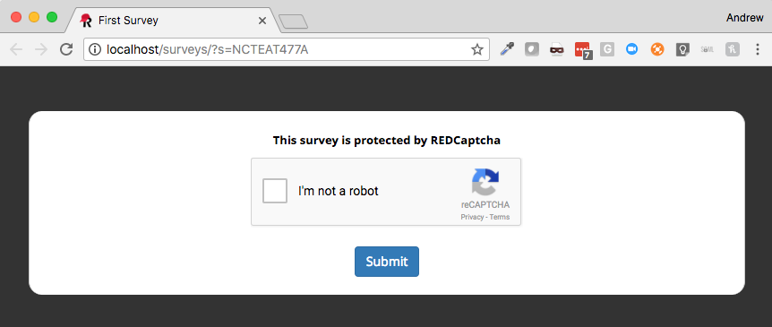

# redcap-em-redcaptcha
This external module, if enabled, will force [Google reCaptcha](https://developers.google.com/recaptcha/) on your public survey url.
 
#### System Level Directions
 * Establish a goolge API key for reCaptcha [here](https://www.google.com/recaptcha/admin#list)
 * Be sure to add the domain of your REDCap server (e.g. redcap.myschool.edu) to the reCaptcha configuration.
 
   > Note that only one API key is needed for an entire server.  All projects will use this same reCaptcha
 * Enable the external module and then as a super-user add the site and private keys you obtained from the previous step into the EM configuration.

#### Project Level Directions
 * Enable the module on a particular project that contains a public survey URL.  Note, if using a multi-arm project with multiple public survey urls all will be protected.
 * Optionally, you can configure custom instructions and error message text on a per-project basis (or leave blank for defaults).  
 
#### Example

 
*Last tested on v8.3.2*
 
